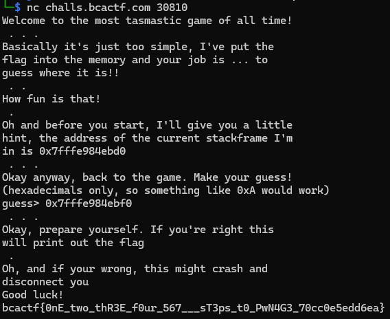

# Pwnage

## It's either a bug, a hack, an exploit, or it's pwnage.

## Let this challenge stand as one of the first of many stairs to mastery over that which can only be described as pwn.

So i checked the code and tried an address that is close to the given.

I run the server and tried address + 0x20.

It was correct and gave me the flag.

Flag: `bcactf{0nE_two_thR3E_f0ur_567___sT3ps_t0_PwN4G3_70cc0e5edd6ea}`