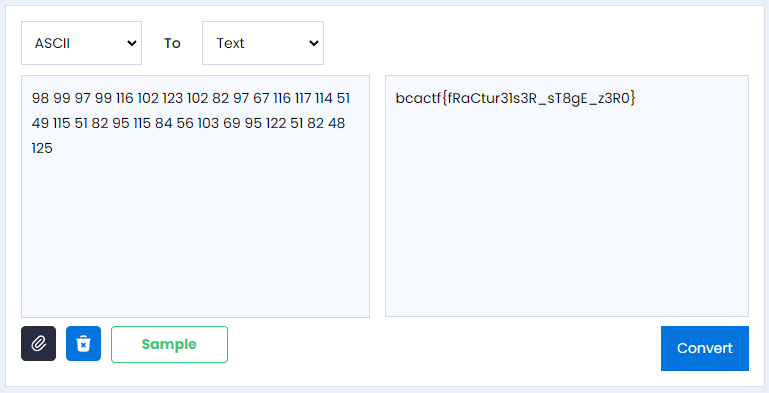

# Flagtureiser

## Here's a totally normal Minecraft mod (1.19.4, Forge) I've been making, check it out!

I opened the .jar file in an online java decompiler.

Checked the flagtureiser.class and it had an array with some ascii codes.
```
static void _6d8f2e1fefef5b67bf4f49179b84f29f7d1e01f0() throws Exception {
	Class.forName(...new String(new byte[]{98, 99, 97, 99, 116, 102, 123, 102, 82, 97, 67, 116, 117, 114, 51, 49, 115, 51, 82, 95, 115, 84, 56, 103, 69, 95, 122, 51, 82, 48, 125})...
}
```

Translated them and found the flag.



Flag: `bcactf{fRaCtur31s3R_sT8gE_z3R0}`