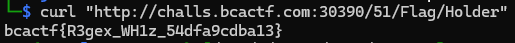

# NoSQL

## I found this database that does not use SQL, is there any way to break it?

I tried to get some results using the hint.

After that i tried to match some values.

Noticed there is a flag holder so i did the payload with his id.

Flag: `bcactf{R3gex_WH1z_54dfa9cdba13}`