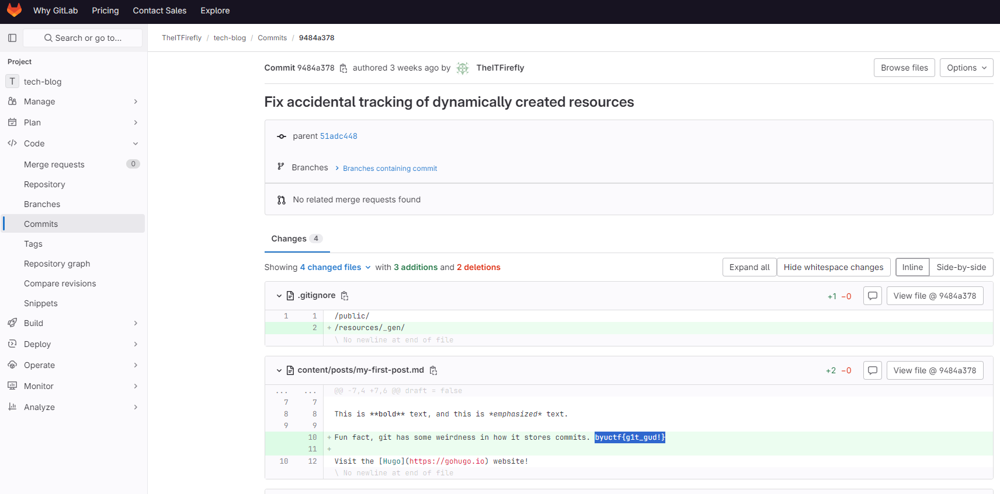

# Gitting Started

## A local hacker, TheITFirefly, who started up a blog to talk about his exploits in the tech world, has hidden a flag in the source code for his blog. Luckily, his source code is publicly available in a git repo!

## https://gitlab.com/TheITFirefly/tech-blog

Opened the link and went on commits.

Found this:

Flag: `byuctf{g1t_gud!}`