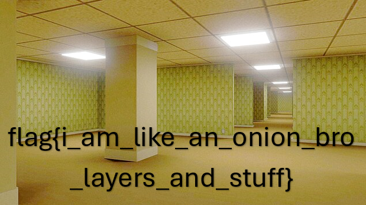

## Challenge

I Have Layers [250]

During the Describe Your Perfect Day challenge, we captured two important bits of data from DEADFACE as they conducted their attack against Turbo Tactical. The first bit is that we have this password-protected zip file and no you can’t brute force it - trust us, we have tried. The second bit is this weird jumble of words that does’t seem to make much sense. Use the previous challenges resources to figure this problem out; this should not rely on having to guess. Think you can figure out how this relates to the zip file?

SSULKORX WTWAVX GJIWTAY IX KT VTCHCVZS IH YTOL BMSB WTLB IP GM IAJ LOS BMS OBU EOMABCGW NH RIGTIGXFAZSBMWCDDDIWISTXGIBMMMHFTMXIVUBJOHBQN

BIG NOTE: The password to the zip file should be formatted as such: SomethingLikeThisDespiteTheOutputOfYourTool

## Solution

When we saw the challenge we thought of decrypting the given ciphertext

Using key bruteforce, we decoded this

Changed the password we found so it matches the format: DoYouReallyThinkYouCanFindMySecretsThatEasily

The zip contained a flag.exe file.

Using the file command we noticed it is a png file

Changing the extension gave us the image, which contained the flag

Flag: `flag{i_am_like_an_onion_bro_layers_and_stuff}`