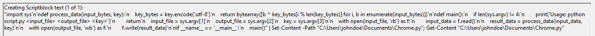
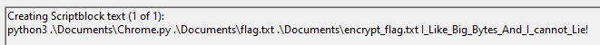

## Challenge

event-code-hunt

Maya Elmer managed to seize one of The Consortium’s computers, but when she tried to access a critical file, a sudden blue box flashed across her screen, and the file was instantly encrypted. Now, with the clock ticking, participants must step in to decrypt the file and uncover the hidden contents. The Consortium's encryption is tough to crack, and only the most determined will succeed in revealing the secrets locked away within.

## Solution

Opened the PowershellOP.evtx file and noticed a command line execution and a script.



Found the key and reversed the script.



This the solve script:

```python
def process_data(input_bytes, key):
    key_bytes = key.encode('utf-8')
    return bytearray([b ^ key_bytes[i % len(key_bytes)] for i, b in enumerate(input_bytes)])

def decrypt_flag(encrypted_file, decrypted_file, key):
    with open(encrypted_file, 'rb') as f:
        encrypted_data = f.read()

    decrypted_data = process_data(encrypted_data, key)
    
    with open(decrypted_file, 'wb') as f:
        f.write(decrypted_data)

encrypted_file = 'encrypt_flag.txt'
decrypted_file = 'decrypt_flag.txt'
key = 'I_Like_Big_Bytes_And_I_cannot_Lie!'

decrypt_flag(encrypted_file, decrypted_file, key)
```

Flag: `NICC{Maya_Elmer_D3t3cts_Mal1c10us_P4yl04d_1n_3v3ntL0gs}`