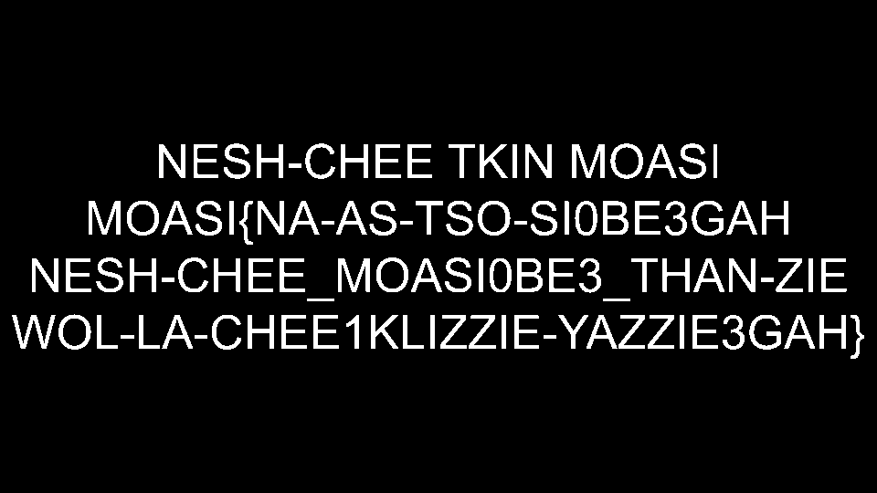

## twisted-tongues

### Red is one of the most recognizable colors of the Roman Empire, associated with the Mars, the God of War. Red banners would be raised during celebrations of military victories. However, something seems off with this banner...

### Each word in the flag should be separated by an underscore. Make sure not to yell when typing in the flag.

- Solution

I put the image online and found some text:

Found out it is Navajo Code so translated it and found the flag.

Flag: nicc{m0d3rn_c0d3_ta1k3r}