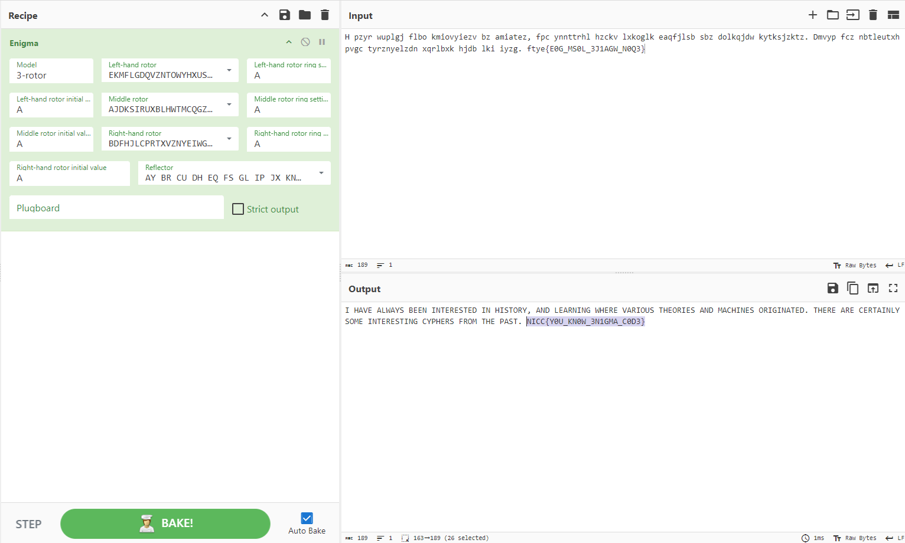

## Strange-Historical-Machine

### A strange machine has appeared in the Underworld, as if from another time. An image of the machine has been crafted, maybe it contains more information on the device...

- Solution

Used exiftool on the file and the Comment section had a [link](https://commons.wikimedia.org/wiki/File:Enigma_(crittografia)_-_Museo_scienza_e_tecnologia_Milano.jpg). I noticed that the file has some data so i extracted them using Binwalk and found a text.txt file. I put it on Cyberchef and got the flag.

Flag: nicc{Y0U_KN0W_3N1GMA_C0D3}