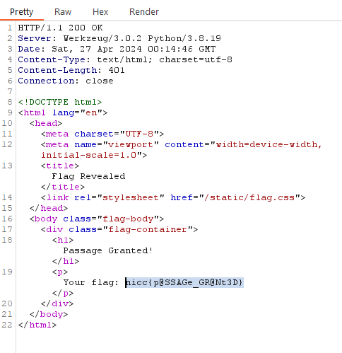

## Socratic-Script

### In the realm of digital Olympus, the Socratic-Script guarded its gates with cunning riddles. Only those versed in wisdom's tongue could unlock its secrets and ascend to the summit of victory. Many seekers faltered, but the chosen few, armed with knowledge, triumphed over the enigmatic challenge, earning their place among the digital deities. Upon your arrival, you discover an ancient tome with writing, what could it mean? Submit the flag found after gaining passage.
### Provided Link: https://springforward-socratic-script.chals.io

- Solution

BurpSuite allows you to modify the requests of a page. So I deleted the script and loaded the page without it. After the upload of the ancient_tome.txt I got the flag.

Flag: nicc{p@SSAGe_GR@Nt3D}