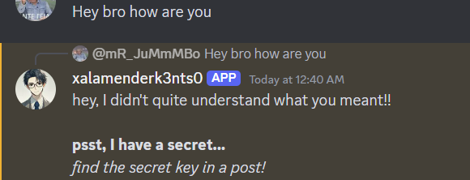

## Challenge

The Pentagon

A few days ago, I saw a funny post on a social media platform.

As far as I remember, there are five accounts that frequently post funny and random content.

I only remember two names: Udin Kurniawan Jaeger and Paijo Abdul Uchiha.

I recall that one of them uses a fake account. The humor in his posts is quite random, and I like it.

I want to know the real name of the person using that second account because I want to connect with him on his main account.

Please help me find his full real name.

The flag is the full name

Example: TCP1P{Kresna Yang Asli}

*Pro tips: Check the case sensitive!

## Solution

First we searched for the given name on google and found this account [here](https://9gag.com/u/paij0uch1h4)

From the liked posts we found the other given account [here](https://9gag.com/u/ud1nwanj4eger)

One of the posts had 14 comments [here](https://9gag.com/gag/avy85Bd) and in the replies of them, there was a user telling us to find a post on instagram

We instantly searched for the post id given in the comments before and we got [here](https://www.instagram.com/p/DAJjWLRzVpw/)

This account has in the profile bio a link to a discord server, so we joined and send e message to the "bot" that said to dm him.

This was his response

So we went back to the profile and searched the posts, until we saw a video of 2 guys talking [here](https://www.instagram.com/p/DA-7LchCpbI/)

In the end of the video they said something backwards so we tried to reverse it and they said this: TCP1P_TH3P3NT490N_1S4W3S0M3

We sent this key back to the bot and gave us a youtube link which has the name in the description.

Flag: `TCP1P{Slamet Setiawan Uzumaki}`