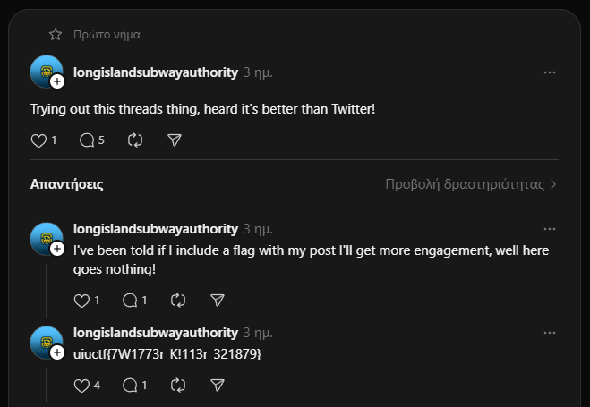

# Hip With the Youth

The Long Island Subway Authority (LISA), in an attempt to appeal to the younger generations, has begun experimenting with social media! See if you can find a way to a flag through their Instagram.

This is part one of a three-part OSINT suite including Hip With the Youth, An Unlikely Partnership, and The Weakest Link. I recommend starting here!

## Solution

The first search gave us a Linkedin profile that didnt help a lot.

Checked their [Instagram](https://www.instagram.com/mtalirr/) for any clues but didn't find anything.

Tried to search the full name on Instagram and found a weird profile with 2 photos.

Didn't find anything in the main page, until we checked the threads of this account.

Flag: `uiuctf{7W1773r_K!113r_321879}`